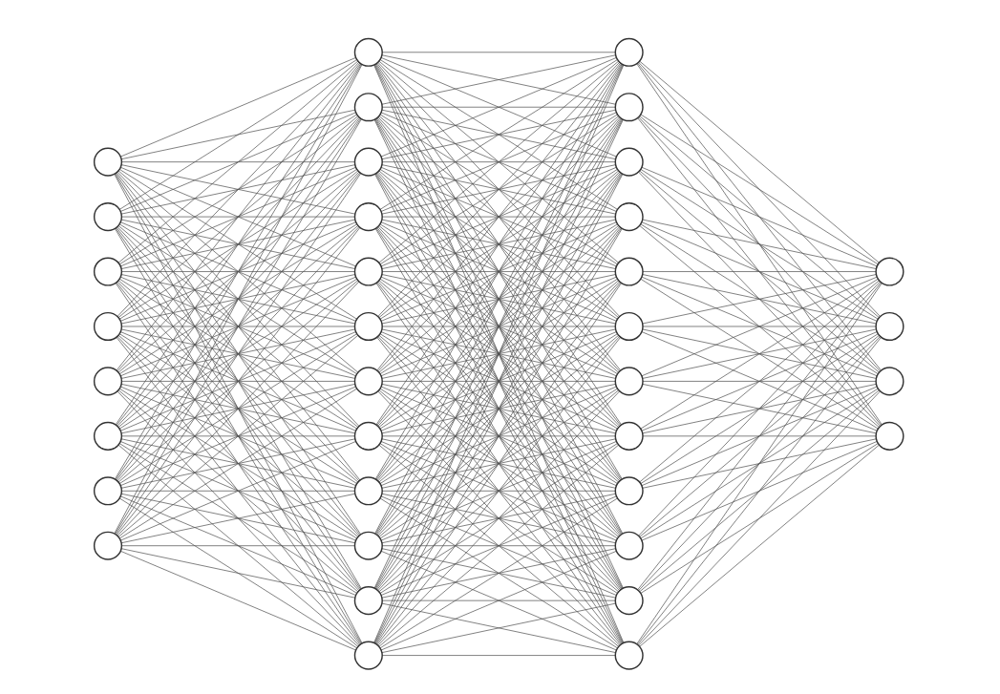
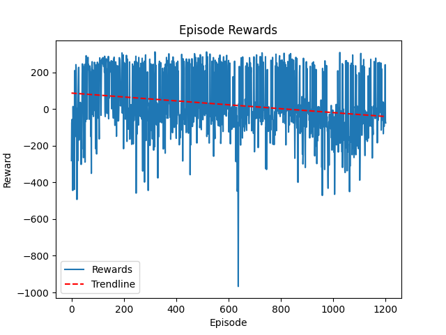

# instadeep-rl-challenge
This is my submission for the instadeep RL challenge in the second phase of the recruitement process.

## Reinforcement learnig framework
The Lunar Landing problem is formulated as a reinforcement learning task, where an agent learns to control the descent of a lunar lander to safely land on the moon's surface. The agent interacts with the environment, comprising different states, takes actions to adjust its orientation and thrust, and receives rewards based on the success or failure of the landing.

## Deep Q-learning

### Agent

The training process involves interacting with the environment, storing experiences in the replay buffer, and updating the Q-network parameters based on sampled batches. By the 200th episode, the model begins to converge and achieves a cumulative reward of 200, indicating successful learning.

### QNetwork

A neural network was used for the action-value function approximation

- Takes the agent's state as input with a size equal to the observation space dimension (8).
- Two fully connected hidden layers with 256 neurons each, applying ReLU activation for non-linearity.
- Produces Q-values for each action in the action space with an output size equal to the action space dimension (4).

### Experience Replay
- In this reinforcement learning experiment, the utilization of experience replay played a crucial role in enhancing the training stability and overall performance of the Deep Q-Network.
- A memory buffer of size 1000000 was used
- The agent samples without replacement from the buffer a batch of 64 transitions for training

### Performance



## Configuration

#### Virtual environment setup
First, create a virutal environment. Make sure the `virtualenv` package is installed
```SHELL
python -m virtual .rlvenv
```
Then, activate the virtual environment
```SHELL
source .rlvenv/local/bin/activate
```
#### Installing dependencies
install the required dependencies found in `requirements.txt`
```SHELL
make install
```

### Docker container
A docker image can be built and ran for this project using the `Dockerfile` (make sure the docker daemon is running)
To build the image, run the following command: 
```SHELL
make build
```
To access the container, run the following command
```SHELL
make run
```
This will give access to the container terminal, you can execute the scripts specified in the next section, after cding into `app/`:
```SHELL
cd app/
```

## Training
To train the agent, run the following command:
```SHELL
make train
```

Training hyperparameters can be set in the `config.yml` file
```YAML
agent:
  epsilon_start: 1.0
  epsilon_end: .05
  epsilon_decay: 0.0005
  alpha: 0.001
  gamma: 0.99
  mem_size: 1000000
  batch_size: 64

training:
  eval_interval: 1
  plot_interval: 100
  n_episodes: 700
  checkpoint_interval: 100

evaluation:
  n_episodes: 20
```
The QNetwork checkpoints get saved periodically to `checkpoints/qnetwork` every `checkpoint_interval` number of iterations.
The saved checkpoint has the following structure:
```SHELL
qnetwork-{n_episodes}-{timestamp}.pth
```
## Monitoring
Reward and loss plots can be found in the `artefacts/` directory.

Real-time monitoring of the training can be done with Tensorboard by launching the command using `ctrl` + `shift` + `p` and typing "Launch Tensorboard" for VScode.


## Evaluation
After training, an agent checkpoint can be evaluated on the environment while it visually renders with the following command:
```SHELL
make evaluate
```

This will prompt with a menu of available checkpoints. A checkpoint can be selected to be used in evaluation. Example
```
 Please choose the QNetwrok checkpoint:

 > qnetwork-10_eps-2023-12-31T11:43:03.pth
   qnetwork-100_eps-2023-12-31T12:46:38.pth
   qnetwork-300_eps-2023-12-31T12:47:32.pth
```


