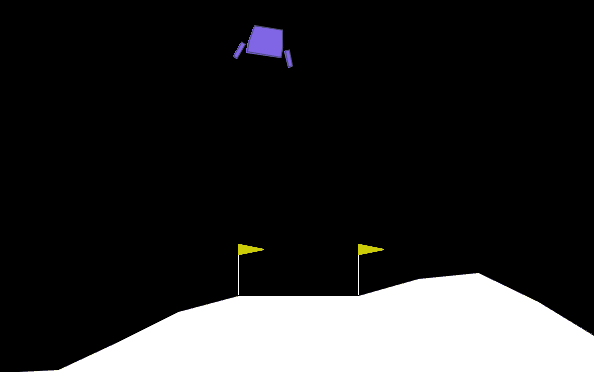

# instadeep-rl-challenge
This is my submission for the instadeep RL challenge in the second phase of the recruitement process.


*Ship landing after being trained with DQN for 700 episodes*


## Configuration

#### Virtual environment setup
First, create a virutal environment. Make sure the `virtualenv` package is installed
```SHELL
python -m virtualenv .rlvenv
```
Then, activate the virtual environment
```SHELL
source .rlvenv/local/bin/activate
```
#### Installing dependencies
install the required dependencies found in `requirements.txt`
```SHELL
make install
```

### Docker container
A docker image can be built and ran for this project using the `Dockerfile` (make sure the docker daemon is running)
To build the image, run the following command: 
```SHELL
make build
```
To access the container, run the following command
```SHELL
make run
```
This will give access to the container terminal, you can execute the scripts specified in the next section, after cding into `app/`:
```SHELL
cd app/
```

## Training
To train the agent, run the following command, there are three available models to choose from: dqn, ddqn and ddpg.
```SHELL
make train AGENT=<agent_name>
```


Training hyperparameters can be set in the `config.yml` file
```YAML
agent:
  epsilon_start: 1.0
  epsilon_end: .05
  epsilon_decay: 0.0005
  alpha: 0.005
  gamma: 0.99
  mem_size: 1000000
  batch_size: 64
  replace_target_cnt: 1000
  device: "cuda"
  tau: 0.001

training:
  log_interval: 1
  n_episodes: 700
  checkpoint_interval: 100
  max_steps_per_episode: 800
  fuel_penalty: 4

evaluation:
  n_episodes: 20

analysis:
  n_samples: 1000
  test_size: .2

```
The QNetwork checkpoints get saved periodically to `checkpoints/<model_name>` every `checkpoint_interval` number of iterations.
The saved checkpoint has the following structure:
```SHELL
qnetwork-{n_episodes}-{timestamp}.pth
```
## Monitoring
Reward and loss plots can be found in the `chekpoints/` directory.

Real-time monitoring of the training can be done with Tensorboard by launching the command using `ctrl` + `shift` + `p` and typing "Launch Tensorboard" for VScode.


## Evaluation
After training, an agent checkpoint can be evaluated on the environment while it visually renders with the following command:
```SHELL
make evaluate AGENT=<agent_name>
```

This will prompt with a menu of available checkpoints. A checkpoint can be selected to be used in evaluation. Example
```
 Please choose the QNetwrok checkpoint:

 > qnetwork-10_eps-2023-12-31T11:43:03.pth
   qnetwork-100_eps-2023-12-31T12:46:38.pth
   qnetwork-300_eps-2023-12-31T12:47:32.pth
```
## Analysis
To run an intepretation analysis on a checkpoint, use the following command:
```SHELL
make analysis AGENT=<agent_name>
```


